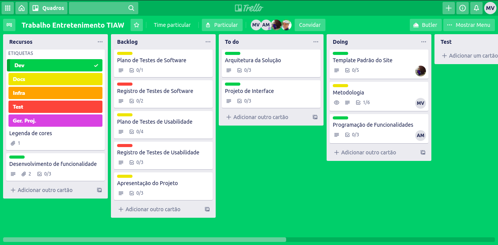

# Gerenciamento de Projeto

> Descreva aqui a metodologia de trabalho do grupo para atacar o
> problema.

## Divisão de Papéis

A equipe utiliza metodologias ágeis, tendo escolhido o Scrum como base para definição do processo de desenvolvimento.

A equipe é composta por:
* Scrum Master: 
    * Marcos Vinicius
* Product Owner:
    * Rommel Carneiro
* Equipe de Desenvolvimento:
    * André Ferreira
    * Lucas Augusto
    * Marcos Vinicius
    * André Fellipe
    * Júlia Michetti
* Equipe de Design:
    * André Fellipe
    * Lucas Augusto

## Processo

Para organização e distribuição das tarefas do projeto, a equipe está utilizando o Trello com as seguintes listas atualmente:
* Recursos: esta lista mantém template de tarefas recorrentes com as configurações padronizadas que todos devem seguir. O objetivo é permitir a cópia destes templates para agilizar a criação de novos cartões.
* Backlog: Contém todas as tarefas a serem trabalhadas. Todas as tarefas identificadas no decorrer do projeto também devem ser incorporadas a esta lista.
* To Do: Esta lista representa o Sprint Backlog. Este é o Sprint atual do que será desenvolvido.
* Doing: Contém as tarefas em andamento
* Test:  Esta lista contém as tarefas que foram concluídas mas ainda não foram testadas. caso a tarefa não passe no teste ela volta para a lista Doing.
* Done: Esta lista contém as tarefas que passaram pelos testes e já podem ser implantadas. Não há mais edições ou revisões necessárias, ela está agendada e pronta para a ação.
* Locked: Quando alguma coisa impede a conclusão da tarefa, ela é movida para esta lista juntamente com um comentário sobre o que está travando a tarefa.

O Quadro kanban pode ser visualizado pela URL: https://trello.com/b/g8zkqpL8/trabalho-entretenimento-tiaw e se encontra no estado atual da Figura X:

        Figura X

## Ferramentas

As ferramentas empregadas no projeto são:

|     `AMBIENTE`      | `PLATAFORMA` |`LINK DE ACESSO`                 |
|--------------------|------------------------------------|----------------------------------------|
Documentos do projeto | Miro | https://miro.com/app/board/o9J_kmo6qLI=/
Documentos do projeto | Google Sheets | https://docs.google.com/spreadsheets/d/1bJRHzBoQvzxgKTgviqt63QRdq5TcwahVRJ3pye-ETnk/edit#gid=0
Documentos do projeto | Google docs | https://docs.google.com/document/d/1fcoRkoe0YWAC5JwPn2jhCwQ_Wx1fG7b-Ase7TAGdC2c/edit#
Gerenciamento do Projeto | Trello | https://trello.com/b/g8zkqpL8/trabalho-entretenimento-tiaw
Gerenciador de código | GitHub | https://github.com/ICEI-PUC-Minas-PMGCC-TI/tiaw-pmg-cc-t-20202-opcoes-de-entretenimento
Projeto de Interface e  Wireframes | Adobe XD | https://xd.adobe.com/view/bc1e3d3f-6f8b-4bfb-a5ab-717fd5dc131f-e94d/screen/33e52edc-c1b5-4629-b6f9-3d2c09d1c1e0
Template padrão do Site | Repl.it | https://givingfrizzything.lucasaaz.repl.co/index.html
Arquitetura da Solução | Github Pages | https://julia120900.github.io/siteTi/

Usamos essas ferramentas pois foram as mais sugeridas pelo Professor e
também foram ótimas para os seus propósitos por isso continuamos a usar.
